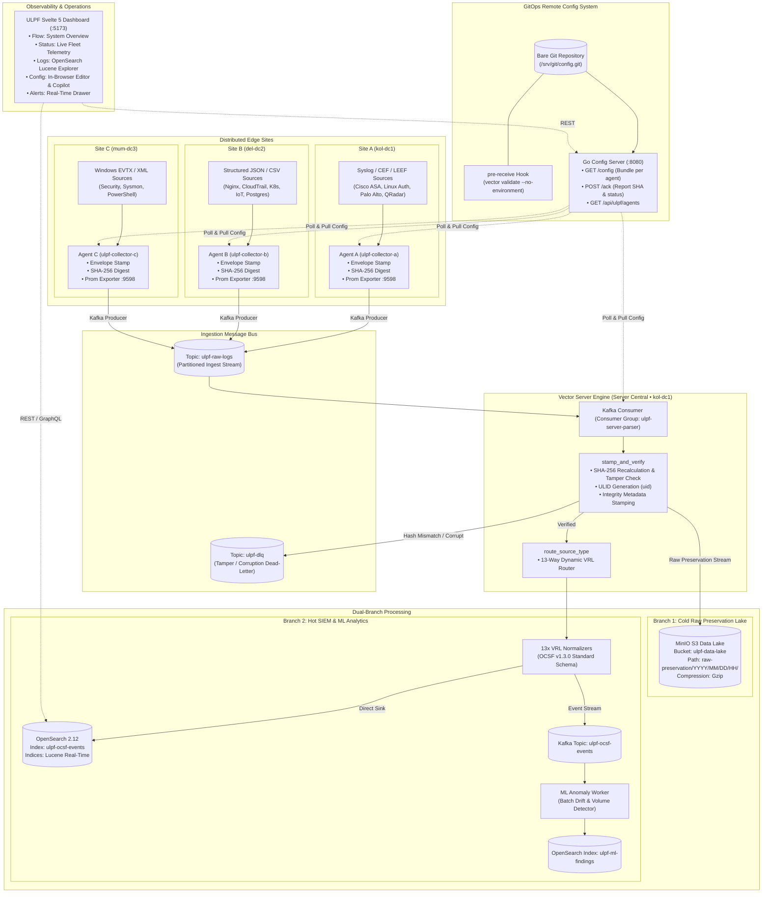
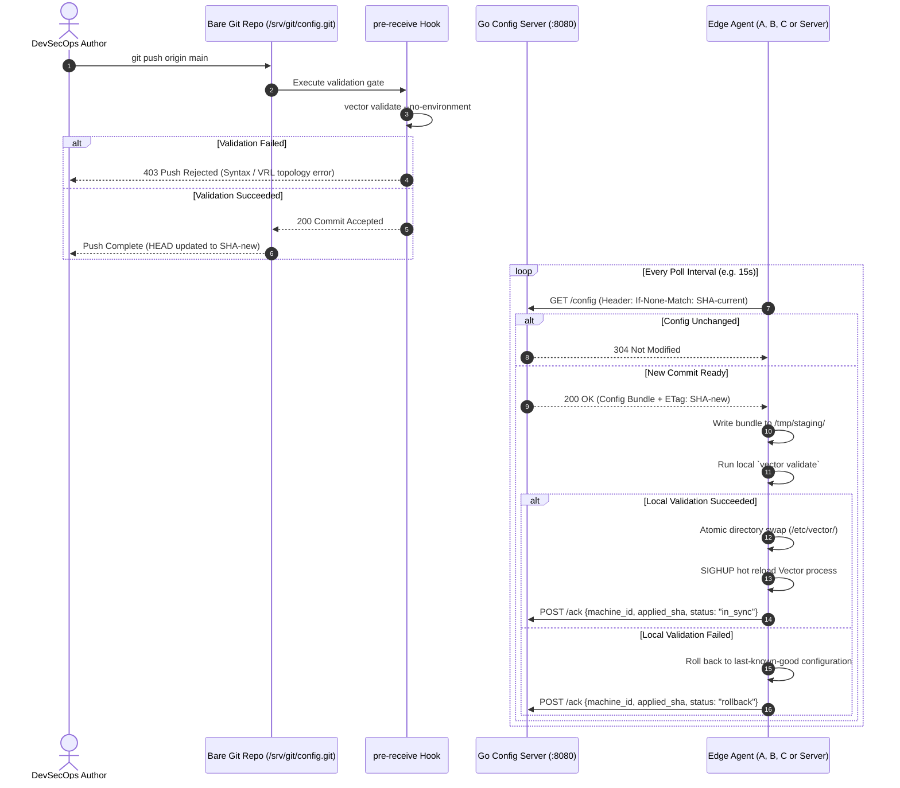

# NTRO ULPF — System Architecture Specification

**Universal Log Pre-processing Framework (ULPF)**  
*SIH 2026 · Problem ID 26156*  
**Revision:** 2.0 (Agent-Server Topology & GitOps Remote Config)

---

## 1. Executive Summary

The **Universal Log Pre-processing Framework (ULPF)** is an enterprise-grade, high-throughput, zero-tamper telemetry and log pre-processing pipeline designed for distributed multi-site sovereign infrastructure. ULPF provides:

1. **Multi-Site Edge Ingestion (Agents):** Distributed edge agents collecting disparate log formats (Syslog, CEF, LEEF, JSON, CSV, AWS CloudTrail, K8s Audit, Windows EVTX/XML) across geographically separated datacenters (**Site A**, **Site B**, and **Site C**).
2. **Metadata Envelope & Zero-Tamper Verification:** Flat JSON envelope encapsulation stamping cryptographic SHA-256 integrity hashes, monotonic sequence numbers, timestamps, and site metadata at the edge.
3. **High-Throughput Ingestion Bus:** Multi-partition Apache Kafka cluster decoupling edge collection from backend processing.
4. **Vector Server Engine (Central Processor):** High-performance VRL (Vector Remap Language) processing engine verifying SHA-256 integrity, stamping global ULIDs (Universally Unique Lexicographically Sortable Identifiers), and routing events into dual downstream branches.
5. **Dual-Branch Architecture:**
   - **Branch 1 (Cold Lake):** S3-compatible raw data lake (MinIO) storing immutable, Gzip-compressed raw preservation envelopes partitioned by date and hour.
   - **Branch 2 (Hot SIEM & ML):** 13 specialized VRL normalizer modules converting heterogeneous logs into standardized **OCSF v1.3.0** (Open Cybersecurity Schema Framework) records, streaming directly to OpenSearch SIEM indices and Kafka topics consumed by independent ML anomaly detection workers.
6. **GitOps Remote Configuration Management:** Bare Git repository acting as the single source of truth, protected by a server-side pre-receive validation gate preventing broken configurations from ever reaching production. Edge agents poll the Go config server via ETags (commit SHAs) and execute atomic swap-and-rollback reload sequences.
7. **Real-time Live Operations Dashboard:** Svelte 5 application providing interactive telemetry, agent status, live OpenSearch log explorer, in-browser configuration editor with Vector validator and AI copilot, and real-time alert monitoring.

---

## 2. High-Level System Architecture



---

## 3. Physical & Logical Sites

The ULPF deployment topology is structured across 3 sovereign sites and one central server node:

| Site Name | Site Identifier | Physical Location | Primary Ingest Workloads | Assigned Node |
|-----------|-----------------|-------------------|--------------------------|---------------|
| **Site A** | `kol-dc1` | Kolkata Datacenter 1 | Network & System Syslog, Palo Alto CEF, IBM QRadar LEEF | `Agent A` (`agent-a-01`) |
| **Site B** | `del-dc2` | Delhi Datacenter 2 | Web Access (Nginx), AWS CloudTrail, K8s Audit, PostgreSQL CSV, IoT JSON | `Agent B` (`agent-b-01`) |
| **Site C** | `mum-dc3` | Mumbai Datacenter 3 | Windows Security Event Logs (EVTX/XML), Sysmon, PowerShell | `Agent C` (`agent-c-01`) |
| **Server Central** | `kol-dc1` | Kolkata Central Core | Central Parser, MinIO Lake, OpenSearch, Kafka Cluster, ML Engine | `Server Parser` (`server-parser-01`) |

---

## 4. Metadata Envelope Specification

At each edge agent, every incoming raw event is immediately encapsulated inside a standardized **v1 Metadata Envelope** before leaving the local host. This guarantees end-to-end auditability and tamper evidence.

### Envelope Schema (Agent Emission)
```json
{
  "envelope_version": 1,
  "site_name": "Site A",
  "site_id": "kol-dc1",
  "agent_id": "agent-a",
  "collector_id": "agent-a",
  "agent_version": "1.0.0",
  "seq": 1791206042982,
  "collected_at": 1791206042982,
  "source_tz": "+05:30",
  "clock": {
    "synced": true,
    "skew_ms": 0
  },
  "source": {
    "type": "fw.cisco.asa",
    "vendor": "Cisco",
    "product": "ASA",
    "product_version": "unknown",
    "transport": "file",
    "host_name": "ulpf-agent-a",
    "position": {
      "path": "/logs/syslog/cisco_asa.log",
      "inode": null,
      "offset": null,
      "line_no": null
    }
  },
  "raw_format": "syslog3164",
  "raw_encoding": "utf-8",
  "raw_len": 128,
  "raw_sha256": "1d53f11e523cdc3eb322bb0af225a3a14ba20ede07ad30e99b9c24f5f60b1da4",
  "raw": "%ASA-4-106023: Deny tcp src outside:192.0.2.1/54321 dst inside:10.0.0.1/80 by access-group \"outside_access_in\"",
  "flags": {
    "truncated": false,
    "multiline_joined": false,
    "decoded_from": null,
    "redacted": false,
    "duplicate_suspect": false
  },
  "labels": {
    "env": "prod",
    "site": "Site A",
    "tier": "agent-a"
  }
}
```

---

## 5. Vector Server Engine & Processing Pipeline

The **Vector Server Engine** runs at Server Central (`kol-dc1`). It is responsible for consuming raw envelopes from Kafka topic `ulpf-raw-logs`, performing cryptographically sound zero-tamper validation, stamping global ULIDs, and executing dual-branch routing.

### 5.1 Step 1: `stamp_and_verify` Transform
Every event consumed from Kafka undergoes verification via VRL:
```vrl
# Recompute SHA-256 over raw payload
calc_sha = sha2(string!(.raw))
orig_sha = string!(.raw_sha256)

# Verify zero-tamper integrity
if calc_sha != orig_sha {
  .tampered = true
  .metadata.integrity.verified = false
  # Event is diverted to DLQ topic 'ulpf-dlq'
} else {
  .metadata.integrity.verified = true
  .metadata.integrity.hash = calc_sha
  .metadata.integrity.algorithm = "sha256"
}

# Generate monotonically sortable ULID
.uid = generate_ulid()
.processed_at = to_unix_timestamp(now(), unit: "milliseconds")
```

### 5.2 Step 2: Dual Branch Routing
1. **Branch 1 (MinIO Cold Storage):**
   - The un-mutated raw preservation envelope (including `.raw`, `.raw_sha256`, `.uid`, and agent metadata) is written to MinIO S3 object storage:
   - Bucket: `ulpf-data-lake`
   - Key format: `raw-preservation/%Y/%m/%d/%H/part-%s-%i.ndjson.gz`
   - Gzip compression with 30-day immutability lifecycle.
2. **Branch 2 (OCSF Normalization & Hot SIEM):**
   - Events are passed to the 13-way VRL routing block based on `source.type`.
   - Mapped into standardized OCSF v1.3.0 classes:
     - `4002` (Network Activity): Cisco ASA, Palo Alto CEF, Nginx Access
     - `3002` (Authentication): Linux Auth (`sshd`, `sudo`, `su`)
     - `2001` (Security Finding): IBM QRadar LEEF
     - `1007` (Audit Activity): AWS CloudTrail, Kubernetes API Audit
     - `1008` (Database Activity): PostgreSQL Query and Mutation Logs
     - `1009` (Device Config / Sensor): Industrial IoT Sensor Logs
     - `1001` (System Activity): Windows EVTX / Sysmon / PowerShell
   - Normalized OCSF records are simultaneously ingested into **OpenSearch** index `ulpf-ocsf-events` and streamed to Kafka topic `ulpf-ocsf-events`.

---

## 6. Remote Configuration Management System

To eliminate human error and ensure that a faulty Vector configuration can **never reach a production machine**, ULPF implements a self-hosted GitOps configuration distribution architecture.



### Key Security & Reliability Invariants
- **Air-Gapped / Self-Hosted:** No dependencies on external GitHub/GitLab services; fully self-hosted Git HTTPS transport.
- **Fail-Safe Gate:** The bare Git repository rejects any commit where `vector validate` does not pass, ensuring HEAD is always 100% valid.
- **Atomic Swap & Hot Reload:** Configurations are validated in staging before swapping into the live directory and sending SIGHUP, avoiding service downtime.
- **Zero-Trust Token Auth:** Each agent presents a scoped Bearer token mapped to its machine and site ID.

---

## 7. Real-Time Operations Dashboard

The ULPF frontend dashboard (built in Svelte 5 and Vite) connects operators to live pipeline telemetry:

- **Flow / Home Tab (`#/`):** Interactive architecture map showcasing live data flow from multi-site agents through Kafka, Server ULID generation, MinIO raw lake, and OpenSearch / ML SIEM.
- **Status Tab (`#/status`):** Real-time health matrix of all agents across Site A, Site B, and Site C, displaying EPS throughput, memory buffer utilization, uptime, version, and hardware metrics.
- **Logs Tab (`#/logs`):** Full-text Lucene query interface retrieving live OCSF normalized logs from OpenSearch with JSON payload inspector, OCSF class distribution breakdown, and quick filtering by Site and Agent.
- **Config Tab (`#/config`):** In-browser multi-file YAML editor for agent and server Vector topologies with real-time Vector validation, one-click deploy, Git version history with rollback, and AI Copilot assistance.
- **Alerts Drawer:** Real-time side drawer reporting pipeline anomalies, ML drift findings, and data quality warnings.

---

## 8. Summary of Components & Ports

| Component | Container Name | Internal Port | Host Port | Protocol / Function |
|-----------|----------------|---------------|-----------|---------------------|
| **Agent A** | `ulpf-collector-a` | 9598 | — | Edge Agent: Syslog/CEF/LEEF (Site A • `kol-dc1`) |
| **Agent B** | `ulpf-collector-b` | 9598 | — | Edge Agent: JSON/CSV (Site B • `del-dc2`) |
| **Agent C** | `ulpf-collector-c` | 9598 | — | Edge Agent: Windows EVTX (Site C • `mum-dc3`) |
| **Server Engine** | `ulpf-central-parser` | 8686 | — | Server Normalizer: ULID & OCSF (Server • `kol-dc1`) |
| **Kafka Bus** | `ulpf-kafka` | 9092 | 9092 | KRaft Message Bus (`ulpf-raw-logs`, `ulpf-ocsf-events`) |
| **MinIO Lake** | `ulpf-minio` | 9000, 9001 | 9000, 9001 | S3 Raw Storage (`ulpf-data-lake`) & Console |
| **OpenSearch** | `ulpf-opensearch` | 9200, 9600 | 9200 | Hot SIEM Index (`ulpf-ocsf-events`, `ulpf-ml-findings`) |
| **OS Dashboards**| `ulpf-opensearch-dashboards`| 5601 | 5601 | OpenSearch Web UI |
| **ML Worker** | `sih2-ml-worker-1`| — | — | Machine Learning Anomaly Detection Service |
| **Config Server**| `ulpf-config-server`| 8080 | 8080 | GitOps Config Distribution & Fleet API |
| **Dashboard UI** | `frontend` | 5173 | 5173 | Svelte 5 Real-Time Operations Interface |
