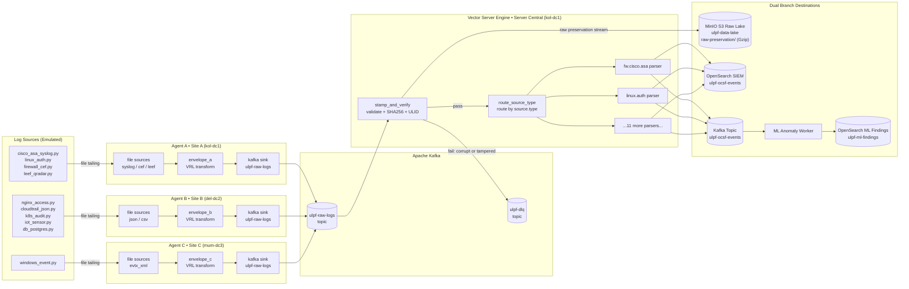

# ULPF Pipeline Data Flow

**Version:** 2.0  
**Architecture:** 3-Agent Vector Fleet (Site A / B / C) → Kafka Ingest Bus → Vector Server Engine → Dual Branch (MinIO Lake & OpenSearch / ML SIEM)

---

## 1. High-Level Architecture



---

## 2. Detailed Data Flow — Step by Step

### Step 1: Log Generation → Log Files

Each emulator writes events (simulating active production devices) to a log file:

```
test-suite/docker/logs/
├── syslog/
│   ├── cisco_asa.log       ← cisco_asa_syslog.py (Site A: Cisco ASA Firewall)
│   ├── linux_auth.log      ← linux_auth.py (Site A: Linux SSH / PAM)
│   └── windows_events.log  ← windows_event.py (Site C: Windows EVTX)
├── cef/
│   └── paloalto.log        ← firewall_cef.py (Site A: Palo Alto PAN-OS)
├── raw/
│   └── qradar.log          ← leef_qradar.py (Site A: IBM QRadar LEEF)
├── json/
│   ├── nginx.log           ← nginx_access.py (Site B: Nginx Access)
│   ├── cloudtrail.log      ← cloudtrail_json.py (Site B: AWS CloudTrail)
│   ├── k8s_audit.log       ← k8s_audit.py (Site B: K8s API Server)
│   └── iot.log             ← iot_sensor.py (Site B: Industrial IoT)
└── csv/
    └── postgres.csv        ← db_postgres.py (Site B: PostgreSQL)
```

---

### Step 2: Edge Agents — Wrap in v1 Envelope

Each Vector Edge Agent instance:
1. Tails its assigned log files using the Vector `file` source.
2. In the VRL remap transform (`envelope_a`, `envelope_b`, `envelope_c`), encapsulates the raw string into the v1 metadata envelope:
   - Computes `raw_sha256 = sha2(string!(.message))`
   - Computes `raw_len = length(string!(.message))`
   - Sets `site_name` ("Site A", "Site B", "Site C") and `site_id` ("kol-dc1", "del-dc2", "mum-dc3")
   - Sets `agent_id` ("agent-a", "agent-b", "agent-c") and `collector_id` (backward-compatibility alias)
   - Sets `source.type`, `source.vendor`, `source.product`, `source.transport`
   - Sets source-specific nested objects (`source.syslog`, `source.cef`, `source.leef`, etc.)
   - Sets `collected_at` = current epoch ms
   - Sets `seq` = incrementing timestamp sequence counter
   - Sets `clock`, `flags`, and `labels` (e.g. `site: "Site A"`, `tier: "agent-a"`)
3. Produces JSON envelope to Kafka topic `ulpf-raw-logs`.

> [!NOTE]
> Edge Agents **never** set `uid`, `ingested_at`, or `integrity.*` — those are stamped exclusively by the Vector Server Engine.

---

### Step 3: Kafka — Transport & Decoupling

- **Topic:** `ulpf-raw-logs`
- **Partitions:** 6 (distributed across agents for parallelism)
- **Retention:** 7 days
- **Serialization:** Flat JSON envelope
- **Ordering Guarantee:** Per-partition ordering

---

### Step 4: Vector Server Engine — Validate, Stamp, Route

The `stamp_and_verify` VRL transform inside `central-parser` executes the validation gate:

```
consume from ulpf-raw-logs
  ↓
validate required envelope fields (site_id, agent_id, raw_sha256, raw)
  ↓ fail → ulpf-dlq
verify sha256(raw) == raw_sha256
  ↓ fail → ulpf-dlq
verify len(raw) == raw_len
  ↓ fail → ulpf-dlq
check source.type in registry
  ↓ fail → ulpf-dlq
  ↓ pass
generate uid = ULID()
stamp processed_time = now_ms()
build metadata.integrity { algorithm: "sha256", hash: calc_sha, verified: true }
  ↓
emit raw envelope → minio_raw_lake (Branch 1: Gzip Cold Lake)
emit verified envelope → route_source_type (Branch 2: Normalization)
```

The `route_source_type` transform splits the stream into 13 per-source-type branches.

---

### Step 5: OCSF v1.3.0 Normalization

Each of the 13 normalizer transforms (`03_parse_cisco_asa` through `13_parse_unknown`):
1. Parses fields from `.raw` using format-appropriate parsing (regex, VRL builtins, JSON, CSV).
2. Builds the standardized OCSF event object with correct `class_uid`, `category_uid`, `activity_id`, `severity_id`, and typed observables.
3. Stamps metadata (`site_name`, `site_id`, `agent_id`, `uid`, `integrity`).
4. Preserves routing and envelope metadata under `unmapped`.
5. Emits normalized OCSF events to:
   - **OpenSearch index:** `ulpf-ocsf-events` (Lucene real-time indexing)
   - **Kafka topic:** `ulpf-ocsf-events` (Real-time stream for ML anomaly detection)

---

### Step 6: Dual Branch Storage & ML Analytics

| Destination | Target | Format / Encoding | Contents |
|-------------|--------|-------------------|----------|
| **Branch 1 (Cold Lake)** | `s3://ulpf-data-lake/raw-preservation/%Y/%m/%d/%H/` | NDJSON.GZ (gzip) | Lossless chain-of-custody raw envelopes with cryptographic digests |
| **Branch 2 (SIEM)** | OpenSearch `ulpf-ocsf-events` | JSON / Lucene | Real-time security analytics and forensic search |
| **Branch 2 (ML Stream)** | Kafka `ulpf-ocsf-events` | JSON | Low-latency stream for machine learning workers |
| **Branch 2 (ML Findings)** | OpenSearch `ulpf-ml-findings` | JSON | ML anomaly detections, volume drifts, and data quality alerts |

---

## 3. Component Responsibilities

| Component | Container Name | Site Location | Responsibility |
|-----------|----------------|---------------|----------------|
| **Agent A** | `ulpf-collector-a` | Site A (`kol-dc1`) | Ingest Syslog, CEF, LEEF; wrap in envelope; produce to Kafka |
| **Agent B** | `ulpf-collector-b` | Site B (`del-dc2`) | Ingest JSON, CSV; wrap in envelope; produce to Kafka |
| **Agent C** | `ulpf-collector-c` | Site C (`mum-dc3`) | Ingest Windows EVTX XML; wrap in envelope; produce to Kafka |
| **Server Engine** | `ulpf-central-parser` | Server Central (`kol-dc1`) | Zero-tamper verification, ULID generation, 13-way OCSF routing, dual-branch write |
| **Kafka Bus** | `ulpf-kafka` | Server Central (`kol-dc1`) | Ingest message bus and OCSF event distribution |
| **MinIO Lake** | `ulpf-minio` | Server Central (`kol-dc1`) | Immutable S3 raw lake (`ulpf-data-lake`) |
| **OpenSearch** | `ulpf-opensearch` | Server Central (`kol-dc1`) | SIEM hot search index (`ulpf-ocsf-events`) |
| **ML Worker** | `sih2-ml-worker-1` | Server Central (`kol-dc1`) | Real-time sliding window anomaly & drift detection |
| **Config Server** | `ulpf-config-server` | Server Central (`kol-dc1`) | GitOps remote configuration server and Fleet API |
| **Operations Dashboard** | Host / Container | All Sites | Real-time visualization, telemetry, and interactive config management |
